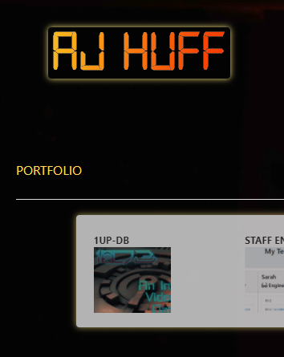
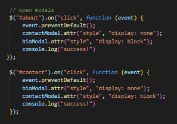
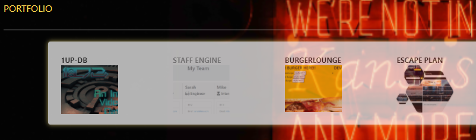

# portfolio-b
  

A responsive portfolio site with a modals for text data, portfolio items, and contact info. Portfolio Images are linked to individual pages. It utilizes the Bulma's CSS Framework grid system and incorporates accessibility standards.

## Table of Contents

* [Tech Used](#tech_used)
* [Usage](#usage)
* [Features](#features)
* [Deployed_Link](#deployed_link)
* [Author](#author)
* [License](#license)

----

## Tech Used

* [HTML](https://developer.mozilla.org/en-US/docs/Web/HTML)
* [Bulma](https://bulma.io/)
* [Javascript](https://developer.mozilla.org/en-US/docs/Web/JavaScript)

## Usage
 
 Users can come to the portfolio and use the links on the main page to navigate the site. The About Me link activates a bio modal with client description, the Portfolio link brings the user to a portfolio gallery where they can click on individual projects which are linked to offsite locations. Users can also click on the Contact Me link for a modal with contact information.

## Features

- Utilization of Bulma's containers and columns, and modal pop ups.

  

- Semantic HTML elements and Alt IDs to guide specific code interpretation.

- Responsive designs ensure image gallery optimal sizing... 

## Deployed Link

* [See Live Site](https://ajhuff7.github.io/portfolio-b/)

---

## Author

**AJ Huff** 

- [Portfolio Site](https://ajhuff7.github.io/portfolio-b/)
- [Github](https://github.com/ajhuff7)
- [LinkedIn](https://www.linkedin.com/in/aj-huff-7696b14b/)

## License

 